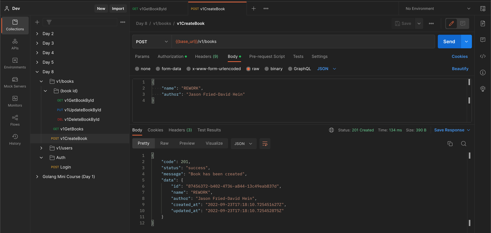

# Todo
## Task 1
1. [x] Create VM AWS EC2

2. [x] SSH Remote to AWS EC2

3. [ ] Deploy app to AWS EC2

## Task 2
1. [x] Create instance DB in RDS

2. [x] Migrate data to RDS

3. [x] Connect App to RDS. `*Sample is with hit endpoint API in below.`

## Test with Postman
[Postman Documentation](https://documenter.getpostman.com/view/12132212/2s7ZT6RkDb)
### Authentication
- [x] Login

## Users
- [x] Get all users

- [x] Get user by id

- [x] Create new user

- [x] Update user by id

- [x] Delete user by id

### Books
- [x] Get all books

- [x] Get book by id

- [x] Create new book

- [x] Update book by id

- [x] Delete book by id
